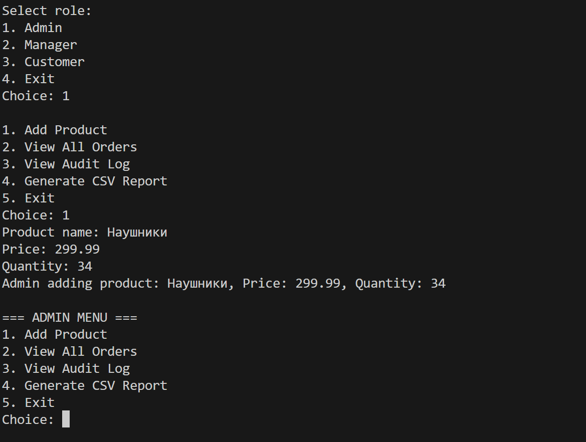
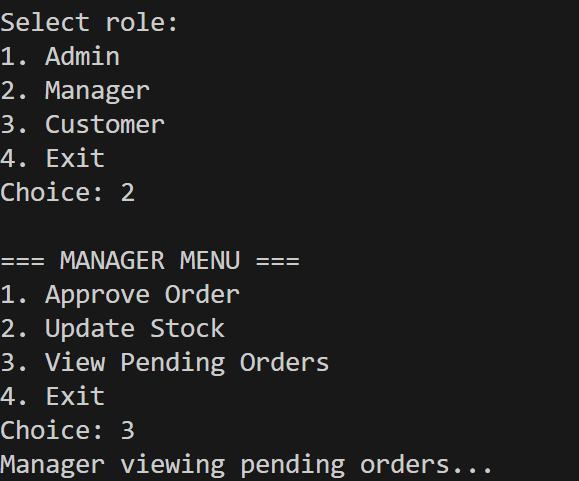
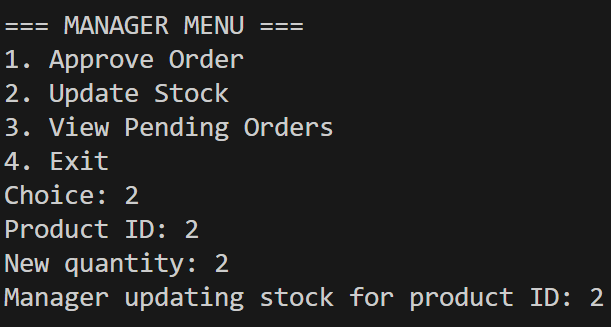

1. Цель работы
Основная цель заключается в разработке интернет магазина с подключением БД PostgreSQL и использованием ООП

Используемое:
PostgreSQL
pibpqxx - установлен через github
Cmake - установлен в VS
C++

2. Архитектура проекта
Классы:
User
Admin
Manager
Customer
Различаются правами у каждого профиля

Order, который управляет OrderItem
Payment
Product, orderItem и PaymentStrategy

Принципы ООП:
Наследование - иерархия пользователей
Полиморфизм - виртуальные методы для ролевого поведения
Композиция - Order владеет OrderItem
Агрегация - User содержит std::shared_ptr<Order>

3. Работа с БД
Структура БД:
users - информация о пользователях и ролях
products - каталог товаров
orders - заказы
order_items - состав заказов
order_status_history - история статусов
audit_log - журнал аудита

Процедуры:
createOrder - создание заказа с транзакцией
updateOrderStatus - изменение статуса с логированием
Триггеры:
order_status_audit - логи изменений статусов
product_price_update - пересчёт стоимости заказов при изменении цены
audit_trigger - запись действий в audit_log

Функции:
getOrderStatusHistory(order_id)
getAuditLogByUser(user_id)
canReturnOrder(order_id)

4. Умные указатели и STL
Умные указатели:
std::unique_ptr<Payment> – оплата заказа
std::shared_ptr<Order> – хранение заказов у пользователя
std::unique_ptr<Product> – управление продуктами

STL и лямбда:
Фильтр заказов по статусу
auto pendingOrders = filterOrders(orders,  {
    return o.getStatus() == "pending";
});

Подсчёт суммы заказов
double total = std::accumulate(orders.begin(), orders.end(), 0.0,
     {
        return sum + order.getTotal();
    });

5. Роли и права доступа

Admin:
Полный доступ ко всем данным
Управление товарами, заказами, просмотр аудита

Manager:
Подтверждение заказов
Обновление остатков товаров
Доступ только к связанным заказам

Customer:
Создание и оплата заказов
Возврат товаров
Доступ только к своим данным

6. Аудит
Таблицы:
order_status_history - фиксация смены статусов
audit_log - логирование всех критических операций

7. Отчет
Запрос для отчета:
SELECT 
    o.order_id,
    o.status,
    h.old_status,
    h.new_status,
    h.changed_at,
    u.name as changed_by,
    a.operation,
    a.performed_at
FROM orders o
LEFT JOIN order_status_history h ON o.order_id = h.order_id
LEFT JOIN audit_log a ON o.order_id = a.entity_id
LEFT JOIN users u ON h.changed_by = u.user_id
WHERE a.entity_type = 'order'
ORDER BY o.order_id, h.changed_at;

8. Сборка и запуск проекта
Требования:
Компилятор C++
PostgreSQL
libpqxx
CMake 3.2

9. Примеры работы:

